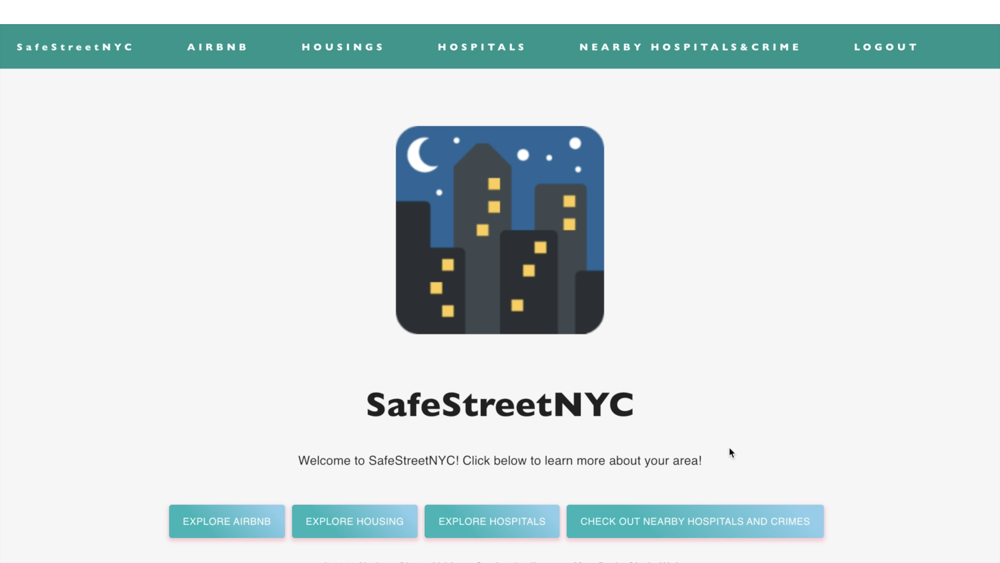
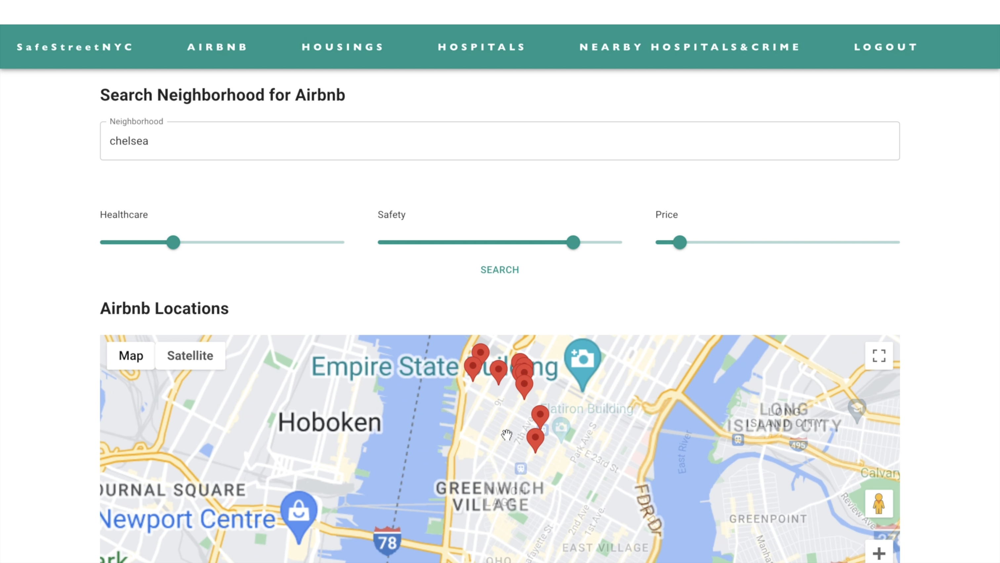
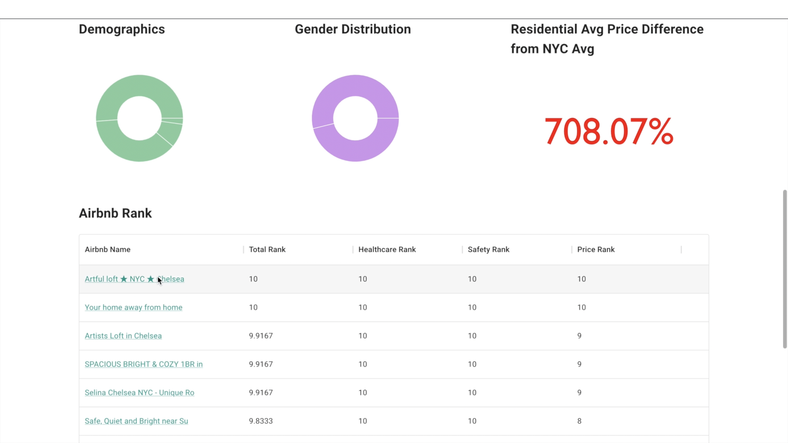
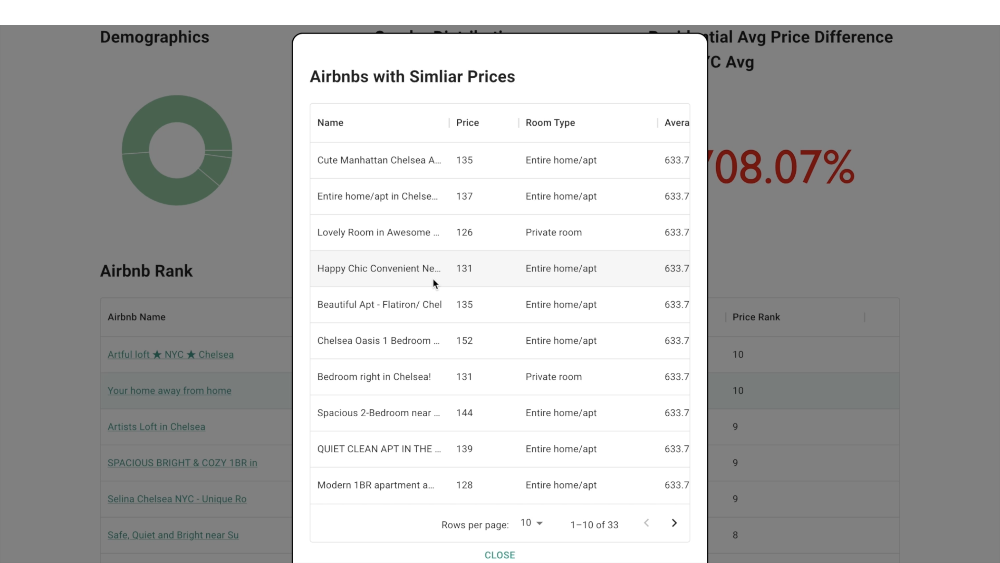
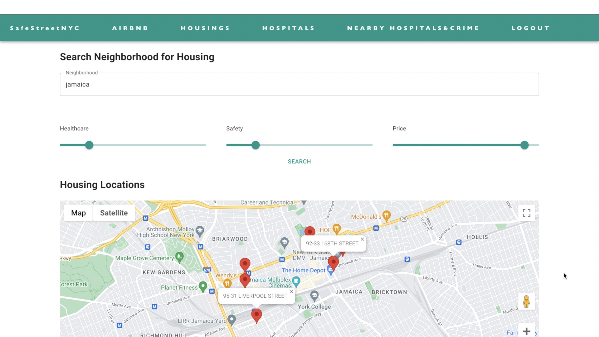
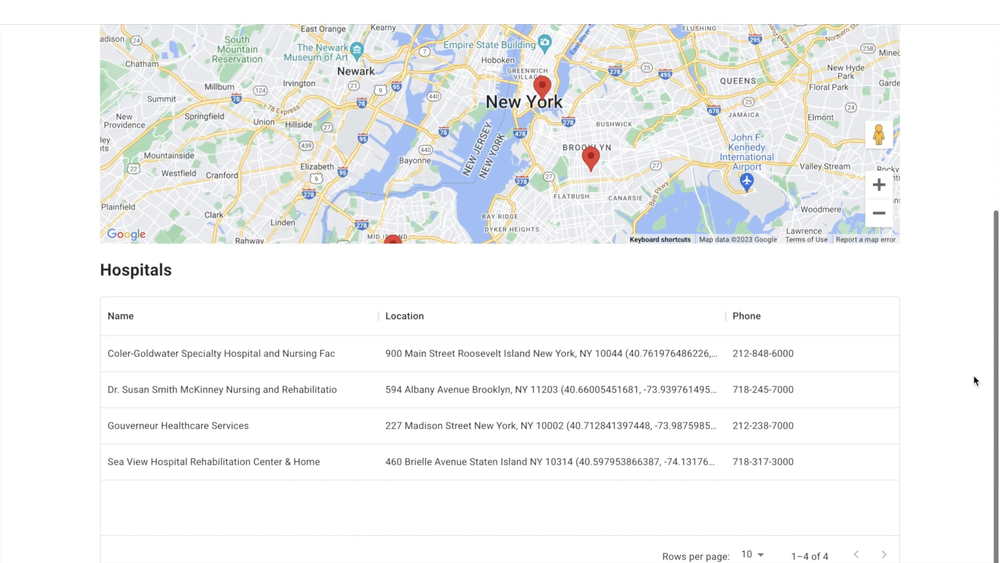
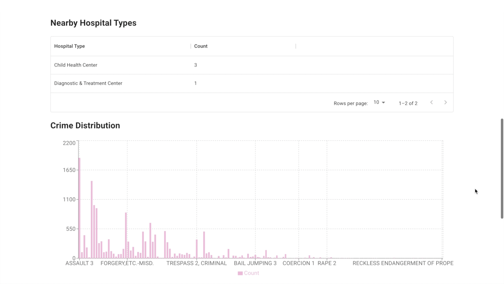
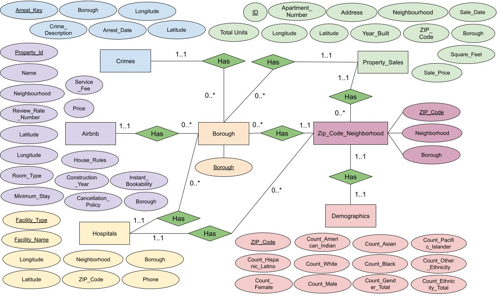
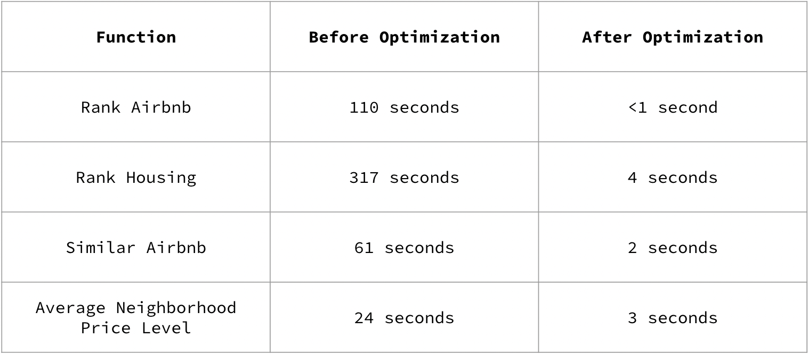

# Welcome to SafeStreetNYC! 🏘️🏙️

- Nathan Chen (DB, Documentation), Abhinav Gopinath (DB), Jiwoong Matt Park (Backend, DB, Markdown), Cindy Wei (Frontend)
- 2023.03.20 ~ 2023.05.11

## How to Run the Program

In order to run the code, open two terminals and access the code file. These are the npm that you have to install for each terminal on the client and server side

Client Terminal:

```
cd client
npm install
npm start
```

Server Terminal:

```
cd Server
npm install
npm start
```

## Introduction

New York is the world’s largest city by population and as such, the day-to-day experiences of New Yorkers vary vastly. For someone trying to move or visit to New York, there will definitely be concerns around whether the neighborhoods/boroughs they choose to locate to are safe and proximate to key services such as healthcare. The application we create will compile data on NY house/Airbnb prices, crime rates, healthcare locations and demographics, and allow users to find different metrics in each of these fields based on location.

**Some of the questions we hope to address include:**

- Which Airbnb or Housing is best for me given my preferences for safety, access to healthcare and price?
- What hospitals do I have near the Airbnb or Housing I am looking for?
- What is the frequency and common crime types that happened near the Airbnb or Housing I am looking for?

Link to a [Youtube Demo](https://www.youtube.com/watch?v=p8X7T2L7yPg&t=80s&ab_channel=JiwoongMattPark).

## Web App Pages Description

Our website has several pages, which have functionality detailed below:

**Login Page:**
This page allows users to create an account/login to our application.


**Front Page:**
This is the landing page which users reach after logging in, and includes a logo, introduction message and links to the other pages of our website.



**Airbnb:**
This page allows users to input a preferred neighborhood, as well as their preferences for safety, healthcare and price. Upon clicking enter, users are able to see the best Airbnbs based on their preferences (and the top 10 are displayed on a map). We also simultaneously return the available room types in that neighborhood, as well as that neighborhood’s demographic breakdown by race and gender, and average price level as a proportion of New York’s average

Users also have the option of clicking on an given Airbnb, and we return a list of other Airbnbs with similar price, healthcare access and crime rate in the same borough

<p float="left">
  
  
  
</p>

**Housing:**
This page allows users to input a preferred neighborhood, as well as their preferences for safety, healthcare and price. Upon clicking enter, users are able to see the best housing options based on their preferences (and the top 10 are displayed on a map).

We also simultaneously return the neighborhood’s demographic breakdown by race and gender, and average price level as a proportion of New York’s average



**Hospitals:**
We allow users to search for a type of hospital, e.g. ‘nursing’, and we return a list of hospital locations which match that criteria

<p float="left">
  
  
</p>

**Nearby Hospital and Crime:**
Users input any address in New York, and a radius which they want to find information for. We return a list of nearby hospitals, as well as statistics on the types of crime which occur within the given radius and their frequency

<p float="left">
  
  
</p>

## Technology

- DB: We used a MySQL database to hold the majority of our data. We had a JavaScript server run routes and retrieve information from our database. The account informations are stored in NoSQL DynamoDB database.

- Frontend: For our frontend, we used React.js, and also incorporated Google Maps API to display some of our results and allow for greater interactiveness in our application.

- Backend: For the backend, we used JS connected with MySQL (with AWS RDS) and DynamoDB.

- Login Security: Finally, for our login features, in addition to the default login method, we implemented Google and Facebook login, and stored our user credentials in DynamoDB with password hashed using SHA 256. We also used APIs from Google Maps, Facebook Login, and Google Login.

## Database

In total, we used data from 6 sources. Of these, 1 was from Kaggle, 1 was from GitHub, and 4 were from the official City of New York data records. A summary of the data is provided below:

**NY Property Sales (Rows: 513K, Columns: 29) |
NYC Citywide Annualized Calendar Sales Update**
This dataset includes data on property sales in New York from 2016 to 2021, and details important information such as the sale price, date, location, building age and type
We used this data to give a baseline estimate of mean property prices in different neighborhoods, and also to give recommendations to users on some favorable locations/properties they would consider based on their preferences for neighborhood, safety, price, and access to healthcare

**NYC Airbnb (Rows: 68653, Columns: 23)
Airbnb-NYC-Cleaned | Kaggle**
This dataset includes data on all Airbnb listings in New York, and important details such as the listing price, location and house rules.
We used this data to give Airbnb recommendations to users based on their preferences for neighborhood, safety, price, and access to healthcare

**NYC Crime (Rows: 5.5M, Columns: 19)
NYPD Arrests Data (Historic)**
This dataset includes data on all crime in New York, dating back to 2016. It includes all important details provided in police reports such as the type of crime and the location/time at which it occurred
We used this data to attempt to quantify which Airbnb/property locations are safest based on their proximity to crime

**NYC Demographics (Rows: 236, Columns: 46)
Demographic Statistics By Zip Code | NYC Open Data**
This dataset includes data on the demographics of all ZIP codes in New York, including details such as the number of people by sex and ethnicity
We use this data to query the demographic breakdown of each neighborhood, and also find neighborhoods which are most similar in their demographics. This dataset interacts closely with the NYC ZIP Codes/Neighborhoods/Boroughs set to allow us to aggregate ZIP codes into neighborhoods

**NYC Hospital (Rows: 78, Columns: 15)
| NYC Health + Hospitals patient care locations - 2011**
This dataset includes data on significant healthcare locations in New York, including details such as the name, type and phone numbers of different locations
We use this dataset to assess the access of different Airbnbs/properties to healthcare facilities, and use this in our ranking process. We also used this dataset to return the healthcare facilities closest to any given location

**NYC Zip Codes/Neighborhoods/Boroughs (Rows: 178, Columns: 3)
| nyc-housing/nyc-zip-codes.csv at master**
This dataset contains data on the neighborhoods and boroughs which each ZIP code belongs to
This is very much a ‘utility’ database, which serves as an interface whenever we have to move between query ZIP Codes, neighborhoods and boroughs

## Database

**Data Processing**
Much of our data was very clean, and we didn’t have to do too much processing aside from removing redundant columns. For our smaller sets, we could easily do this processing using Excel.

For our larger sets and those with more discrepancies, we used Python and Pandas/Numpy. Such processing included removing columns, standardizing values (e.g. changing ‘M’ to Manhattan, ‘01/01/19’ to ‘01/01/2019’) and removing values which fit certain criteria (e.g. date earlier than 2019).

We have included some of our data cleaning code in our final submission (we unfortunately did not retain all of it as we did not have the foresight of keeping it for this final submission).

**ER Diagram**


**Proof of BCNF:**
In many of our tables, we have included longitude and latitude, as well as neighborhood (e.g. Chelsea) &/or Borough (e.g. Manhattan) &/or address &/or ZIP_Code. Whilst it could be argued that neighborhood, borough, address and ZIP_Code all depend on longitude and latitude, it is infeasible from a computational standpoint to lift these dependencies from our table and put them all into their own table. Both longitude and latitude are recorded to 6 decimal points, so it would be unrealistic to lift every single longitude/latitude combination in New York into its own table. We have not normalized these dependencies for practical reasons. However, we can otherwise see that our tables are sufficiently normalized for all other functional dependencies.

## Table Names

**Airbnb**
Property_Id determines all of the other attributes, as each Airbnb is unique. Property_Id serves as a superkey for the relation, so Airbnb is in BCNF (if we ignore the longitude/latitude dependencies stipulated above).

**Crimes**
Arrest_Key determines all of the other attributes, as each arrest is unique. Arrrest_Key serves as a superkey for the relation, so Crimes is BCNF (if we ignore the longitude/latitude dependencies stipulated above).

**Property_Sales**
ID determines all of the other attributes, as each sale is unique. ID serves as a superkey for the relation, so Property_Sales is in BCNF (if we ignore the longitude/latitude dependencies stipulated above).

We should also note that Apartment_Number, Address, Total Units, Year_Built, and Square_Feet cannot really be functionally dependent on one another, as our database has a very complex range of property sales. For the same address, it is possible that the entire building is being sold, or just 1 unit. It is also possible that a unit appears multiple times in our relation but has different Year_Built and Square_Feet due to development.

**Hospitals**
Facility_Name and Facility_Type determine all of the other attributes, as each specific facility name/type has its unique locations and phone number. Facility_Name and Facility_Type serve as a superkey for the relation, so Hospitals is in BCNF.

We should note that Facility_Name alone cannot serve as the superkey, as some facilities appear in our relation multiple times with different functions (e.g. the emergency room vs the children’s hospital).

**Demographics**
ZIP_Code determines all of the other attributes, as each ZIP code has its own unique demographics. ZIP_Code serves as a superkey for the relation, so Demographics is in BCNF.

**Zip_Code_Neighbourhood**
ZIP_Code determines all of the other attributes, as each ZIP code has its own unique neighborhood and borough. ZIP_Code serves as a superkey for the relation, so Zip_Code_Neighbourhood is in BCNF.

**Boroughs**
This table only has one column and hence no functional dependencies, so is trivially BCNF.

## API Specification

**Route: /getneighborhooddemographics/:neighborhood**

- Description: For a given neighborhood, returns the demographics of that neighborhood
- Route Parameters: neighborhood (string)
- Example Input: neighborhood = “Chelsea”
- Query Parameters: none
- Response Parameters: PCT_Male, PCT_Female, PCT_American_Indian, PCT_Asian, PCT_Black, PCT_Latino, PCT_Pacific_Islander, PCT_White, PCT_Other_Ethnicity (all decimals)

**Route: /gethospitaltype**

- Description: Returns info on hospitals catering to a specific group of patients
- Route Parameters: none
- Query Parameters: Facility_Type (string)
- Response Parameters: Name (string), Location (string), Phone (string), Latitude (decimal), Longitude (decimal)

**Route: /getlocalcrime**

- Description: returns the crime descriptions of crime which have occurred within some distance from a given location
- Route Parameters: none
- Query Parameters: latitude, longitude, distance
- Response Parameters: Descriptions of the types of crimes occurring in a given radius (string), frequency of each type (int)

**Route: /getlocalhospitals**

- Description: Returns information on the types of hospitals and their frequencies which are within a specified distance from a given location
- Route Parameters: none
- Query Parameters: longitude (decimal), latitude (decimal), search radius (int)
- Response Parameters: Facility_Type (string), Count (int)

**Route: /getrankhousing**

- Description: Queries and ranks the best housing based on the user preference of low crime rate, healthcare, or price.
- Route Parameters: none
- Query Parameters: healthcare_weight (float), safety_weight (float), price_weight (float), Neighborhood (string)
- Response Parameters: address (string), rank_address (float)

**Route: /getrankairbnb**

- Description: Queries and ranks the best Airbnbs based on the user preference of low crime rate, healthcare, or price.
- Route Parameters: none
- Query Parameters: healthcare_weight (float), safety_weight (float), price_weight (float), Neighborhood (string)
- Response Parameters: address (string), rank_address (float)

**Route: /getavailablerooms**

- Description: Find the most common types of rooms available for rent in the given neighborhood, along with the percentage of listings with instant bookability
- Route Parameters: none
- Query Parameters: given_neighborhood (string)
- Response Parameters: room type (string), room_count (int), bookability_percentage (float)

**Route: /findsimilarairbnbsbyprice**

- Description: Query to find if there are any other Airbnb listings available in the same neighborhood and price range as the specific Airbnb
- Route Parameters: N/A
- Query Parameters: given_property (int)
- Example Input: given_property = 1001012
  Response Parameters: property_id (int), price (float), room_type (string)

**Route: /findsimilarbypricecrimehospitalborough**

- Description: Query to find other Airbnb properties in the same neighborhood with similar prices and the crime rate in that borough
- Route Parameters: N/A
- Query Parameters: given_property (int)
- Response Parameters: property_id (int), price (float), room_type (string)

## Queries & Optimization

Our Airbnb Ranking Algorithm:


## Technical Challenges

- Extremely large datasets which made some queries intractable
  Reducing the size of these sets by only choosing the most essential data \* E.g. only considering crime which happened in or after 2019
- Complex queries which were difficult to optimize
- Compromising the accuracy of our results in some cases, and reduce the size of the sets being considered in our queries
  - E.g. instead of comparing all houses in a neighborhood with all local crimes in that area, choosing a sample of crimes and giving a close approximation of crime in different areas
- Github merge errors with pushing and pulling
  - Working on separate branches and communicating closely before merging
  - Manually copy and pasting code for smaller fixes :)
  - Sensitive information (secret keys) were stored in .env files and used gitignore
